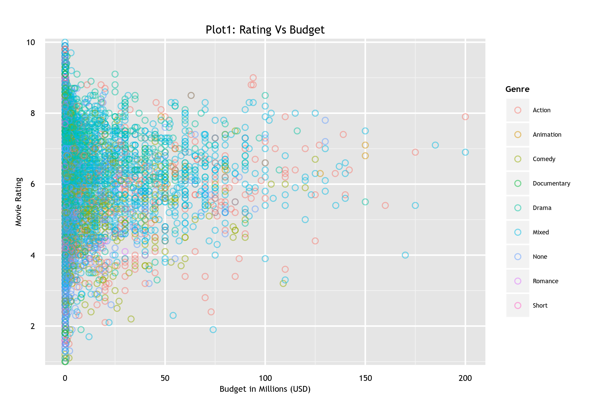
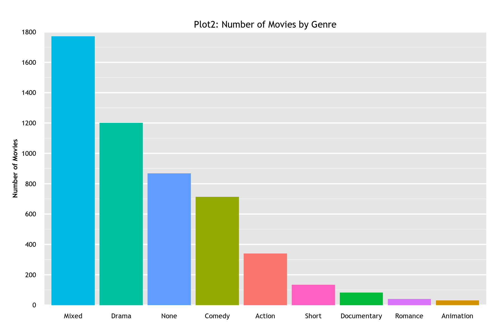
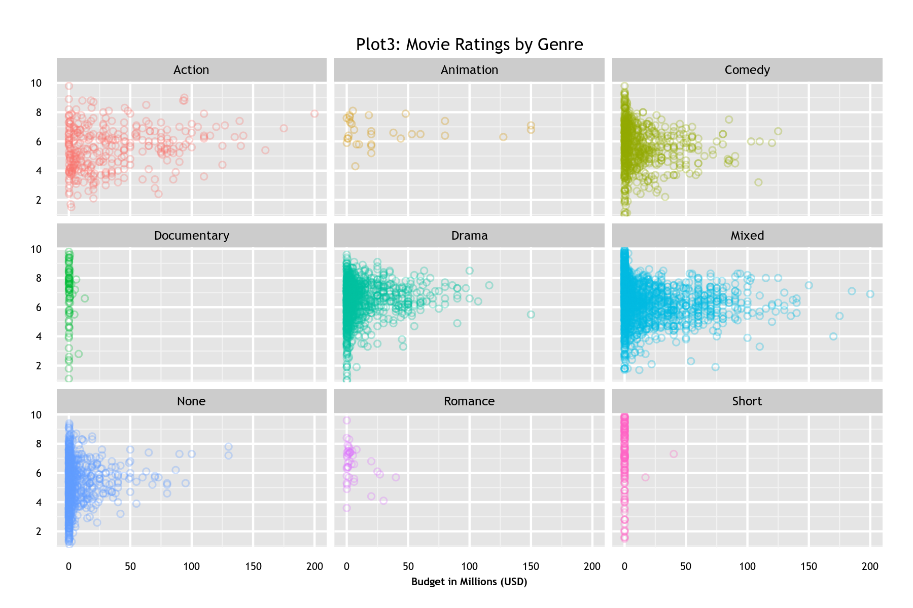
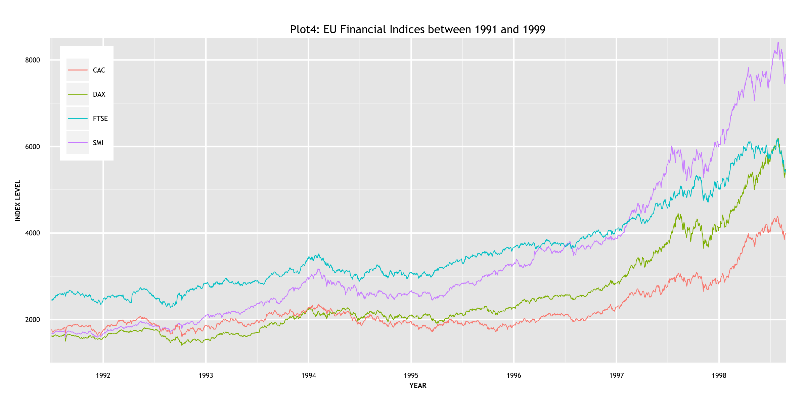

Homework 1: Basic Charts
==============================

Setup
------------------------------

This assignment will use the `movies` dataset in the `ggplot2` package and the `EuStockMarkets` dataset. 
Use the following code to load the datasets:

```
library(ggplot2) 
data(movies) 
data(EuStockMarkets)
```

Then, perform the following transformations:

- Filter out any rows that have a `budget` value less than or equal to 0 or an 'NA' in the **`movies`** dataset. 
  ```
  idx <- which(movies$budget <=0 | is.na(movies$budget))
  movies <- movies[-idx,]
  ```

- Add a `genre` column to the `movies` dataset as follows:
  ```
  genre <- rep(NA, nrow(movies))
  count <- rowSums(movies[, 18:24])
  genre[which(count > 1)] = "Mixed"
  genre[which(count < 1)] = "None"
  genre[which(count == 1 & movies$Action == 1)] = "Action"
  genre[which(count == 1 & movies$Animation == 1)] = "Animation"
  genre[which(count == 1 & movies$Comedy == 1)] = "Comedy"
  genre[which(count == 1 & movies$Drama == 1)] = "Drama"
  genre[which(count == 1 & movies$Documentary == 1)] = "Documentary"
  genre[which(count == 1 & movies$Romance == 1)] = "Romance"
  genre[which(count == 1 & movies$Short == 1)] = "Short"

  # Add the Genre column to the movies2 dataframe
  movies$Genre <- as.factor(genre)
  ```

- Transform the **`EuStockMarkets`** dataset to a time series as follows:
  ```
  eu <- transform(data.frame(EuStockMarkets), time = time(EuStockMarkets))
  ```

Visualizations & Discussion
------------------------------

- **Plot 1: Scatterplot.** 

Below is the scatter plot for the movies dataset. With `budget` as x-axis and `rating` as the y-axis, i felt it is better to have a color scheme to distinguish the different genres of movies, hence assigned the colors to the data points based on the `Genre` they are categorized as. 



Although the visual is not vastly improved but at the least, there is some demarcation between the different genre of movies. The x-axis has been scaled and expressed in millions of USD and a legend added as an aid for identification. Since the number of reviews for *Mixed* are way too many in number, they overlap most of the other genres.

- **Plot 2: Bar Chart.** 

I initially tried the bar plot without any colors or ordering, but the results were not very meaningful, the bars were arranged alphabetically, so i used the `reorder()` function to reorder the `Genre` so that the bars are arranged in a descending order and then plotted the bar chart. The chart is as below. 



Colors were added to distinguish the different genres and the legend which comes by default was removed so that a more simplistic minimal is achieved without losing any information. The axes were scaled and breaks were added to the axis and gridlines were removed to get a minimalistic bar chart.

- **Plot 3: Small Multiples.** 

This plot is a slight modification of the first plot (scatter plot), here the scatter plots are created using the `facet_wrap` function and each of the facets are color coded by the genre. The legend is removed and the points are made slightly transparent as there is high overlap.



Simple but interesting conclusions can be drawn from the facet plots, we can see that *Short* and *Documentary* movies have much lower budgets but have higher ratings on aggregate. *Action* movies have much higher budgets and not all high budget movies get high ratings. *Comedy* seems to have low to medium budgets but in general have higher ratings.

- **Plot 4: Multi-Line Chart.** 

This plot indicates the trend of the EU markets between the years 1991 and 1991. In order to plot the multiline plot, i type cast the timeseries format data *time* to a numeric column during plotting and created a ggplot object on top of it multiple layers of the `geom_line` are used to get the desired time series representation.



Formatting, in terms of font, text and title sizes have been kept consistent for all the plots and also the color schemes are consistent across the plots. 
